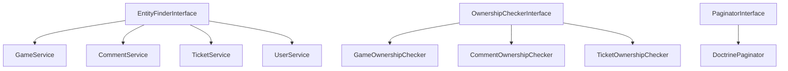
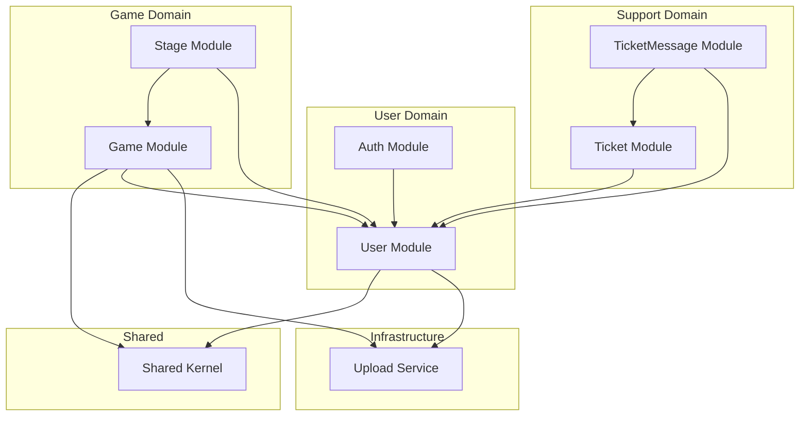
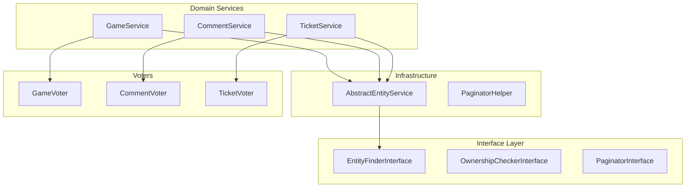

# Архитектурный анализ проекта Game Generator MVP

## Содержание
1. [Дубли кода](#1-дубли-кода)
2. [Плохие практики](#2-плохие-практики)
3. [Возможности для переиспользования](#3-возможности-для-переиспользования)
4. [Рефакторинг через абстрактные классы и интерфейсы](#4-рефакторинг-через-абстрактные-классы-и-интерфейсы)
5. [Рекомендации по разделению монолита](#5-рекомендации-по-разделению-монолита)
6. [План внедрения](#6-план-внедрения)

---

## 1. Дубли кода

### 1.1 Дублирование пагинации в контроллерах

**Проблема:** Во всех контроллерах повторяется одинаковый код извлечения параметров пагинации:

```php
// GameController.php:39-40
$page = $request->query->getInt('page', 1);
$limit = $request->query->getInt('limit', 20);

// GameCommentController.php:32-33
$page = $request->query->getInt('page', 1);
$limit = $request->query->getInt('limit', 20);

// TicketMessageController.php, UserService.php и т.д.
```

**Решение:** Создать [`PaginationRequest`](src/DTO/Requests/) DTO или трейт.

---

### 1.2 Дублирование структуры ответа с пагинацией

**Проблема:** Идентичная структура ответа во многих методах:

```php
// GameController.php:44-54
return ApiResponse::success([
    'items' => array_map(fn($item) => ..., $result['items']),
    'pagination' => [
        'page' => $page,
        'limit' => $limit,
        'total' => $result['total']
    ]
]);
```

**Решение:** Создать [`PaginatedResponse`](src/DTO/Responses/) DTO.

---

### 1.3 Дублирование findOrFail паттерна в сервисах

**Проблема:** Каждый сервис содержит свой метод поиска сущности:

- [`GameService::findGameOrFail()`](src/Service/GameService.php:170) 
- [`CommentService::findCommentOrFail()`](src/Service/CommentService.php:100)
- [`TicketService::findOrFail()`](src/Service/TicketService.php:107)
- [`UserService::getUser()`](src/Service/UserService.php:71)

```php
// Пример из GameService.php:170-177
private function findGameOrFail(int $id): Game
{
    $game = $this->gameRepository->find($id);
    if (!$game) {
        throw new ApiException(ErrorCode::GAME_NOT_FOUND);
    }
    return $game;
}
```

---

### 1.4 Дублирование проверки прав доступа

**Проблема:** Множество похожих проверок владения:

- [`GameService::checkAccess()`](src/Service/GameService.php:179)
- [`CommentService::checkCommentOwnership()`](src/Service/CommentService.php:111)
- [`StageService::checkAccess()`](src/Service/StageService.php:81)

```php
// Пример из GameCommentService.php:111-115
private function checkCommentOwnership(GameComment $comment, User $user): void
{
    if ($comment->getAuthor()->getId() !== $user->getId()) {
        throw new ApiException(ErrorCode::FORBIDDEN);
    }
}
```

---

### 1.5 Дублирование паттерна обновления с null проверками

**Проблема:** Массовое дублирование паттерна частичного обновления:

```php
// GameService.php:122-151
if ($request->title !== null) {
    $game->setTitle($request->title);
}
if ($request->description !== null) {
    $game->setDescription($request->description);
}
// ... и так далее для каждого поля
```

Аналогично в [`StageService::update()`](src/Service/StageService.php:41), [`UserService::updateProfile()`](src/Service/UserService.php:23).

---

### 1.6 Дублирование проверки ролей

**Проблема:** Проверка ролей разбросана по коду:

```php
// TicketService.php:118-122
private function denySupport(User $user): void
{
    if (!in_array('ROLE_SUPPORT', $user->getRoles())) {
        throw new ApiException(ErrorCode::FORBIDDEN);
    }
}

// UserService.php:101-103
if (!in_array('ROLE_ADMIN', $admin->getRoles())) {
    throw new ApiException(ErrorCode::FORBIDDEN);
}

// StageService.php:83
if ($game->getAuthor()->getId() !== $user->getId() && !in_array('ROLE_ADMIN', $user->getRoles())) {
```

---

## 2. Плохие практики

### 2.1 Бизнес-логика в Entity

**Проблема:** Entity [`User`](src/Entity/User.php:234) содержит методы бизнес-логики:

```php
// User.php:234-237
public function isAdmin(): bool
{
    return in_array('ROLE_ADMIN', $this->getRoles());
}

// User.php:239-242
public function isGameAuthor(Game $game): bool
{
    return $this->getId() === $game->getAuthor()->getId();
}
```

**Рекомендация:** Вынести в отдельный сервис `AuthorizationService` или использовать Symfony Voters.

---

### 2.2 Timelineable логика в Entity без интерфейса

**Проблема:** Дублирование полей `createdAt`, `updatedAt` без общего интерфейса:

- [`Game`](src/Entity/Game.php:53-56) - имеет createdAt, updatedAt с #[ORM\PreUpdate]
- [`GameComment`](src/Entity/GameComment.php:39-42) - имеет createdAt, updatedAt без PreUpdate
- [`Stage`](src/Entity/Stage.php:40-43) - имеет createdAt, updatedAt с #[ORM\PreUpdate]
- [`Ticket`](src/Entity/Ticket.php:41-47) - имеет createdAt, updatedAt, closedAt

**Рекомендация:** Создать trait `TimestampableTrait` или использовать Doctrine Extensions.

---

### 2.3 Статические фабричные методы в DTO

**Проблема:** DTO Responses используют статические методы `fromEntity()`:

```php
// GameResponse.php:33-61
public static function fromEntity(Game $game, bool $isLiked = false): self
{
    return new self(
        id: $game->getId(),
        // ... все поля
    );
}
```

Это делает невозможным внедрение зависимостей и тестирование.

**Рекомендация:** Использовать Data Transformer или Mapper сервисы.

---

### 2.4 Создание UserSettings в конструкторе User

**Проблема:** В [`User::__construct()`](src/Entity/User.php:75-84):

```php
public function __construct()
{
    // ...
    $this->userSettings = new UserSettings();
    $this->userSettings->setOwner($this);
}
```

Это нарушает принцип единственной ответственности и создаёт проблемы приunit-тестировании.

---

### 2.5 N+1 проблема в Response DTO

**Проблема:** В [`GameResponse`](src/DTO/Responses/GameResponse.php:55-56):

```php
commentsCount: count($game->getComments()), //TODO фикс на производительное решение
likesCount: count($game->getLikes()),       //TODO фикс на производительное решение
```

Уже помечено как проблема - вызовет дополнительные запросы при ленивой загрузке.

---

### 2.6 Хардкод URL API

**Проблема:** В [`GameGenerationService`](src/Service/GameGenerationService.php:18-19):

```php
private const API_URL = 'https://routerai.ru/api/v1';
private const MODEL = 'qwen/qwen3-vl-8b-thinking';
```

**Рекомендация:** Вынести в конфигурацию (.env, parameters.yaml).

---

### 2.7 Комментарии TODO в продакшен коде

**Проблема:** Незавершённые задачи в коде:

```php
// User.php:225
public function eraseCredentials(): void
{
    // TODO: Implement eraseCredentials() method.
}
```

---

## 3. Возможности для переиспользования

### 3.1 Pagination Helper

Можно создать универсальный класс для пагинации:

```php
class PaginationHelper
{
    public static function extractFromRequest(Request $request): PaginationParams
    {
        return new PaginationParams(
            page: $request->query->getInt('page', 1),
            limit: $request->query->getInt('limit', 20)
        );
    }
    
    public static function createResponse(array $items, int $total, PaginationParams $params): PaginatedResponse
    {
        return new PaginatedResponse(
            items: $items,
            page: $params->page,
            limit: $params->limit,
            total: $total
        );
    }
}
```

---

### 3.2 Generic Repository Methods

Все репозитории используют одинаковые паттерны:

```php
$items = $this->repository->findBy(
    ['field' => $value],
    ['createdAt' => 'DESC'],
    $limit,
    ($page - 1) * $limit
);
$total = $this->repository->count(['field' => $value]);
```

Можно добавить методы в абстрактный репозиторий или trait.

---

### 3.3 Entity Update Trait

Для паттерна частичного обновления можно создать trait или helper:

```php
trait PartialUpdateTrait
{
    public function updateIfNotNull(object $entity, string $setter, mixed $value): void
    {
        if ($value !== null) {
            $entity->$setter($value);
        }
    }
}
```

---

## 4. Рефакторинг через абстрактные классы и интерфейсы

### 4.1 Предлагаемые интерфейсы



#### EntityFinderInterface

```php
interface EntityFinderInterface
{
    public function findOrFail(int $id): object;
    public function getEntityClass(): string;
    public function getErrorCode(): ErrorCode;
}
```

#### OwnershipCheckerInterface

```php
interface OwnershipCheckerInterface
{
    public function checkOwnership(object $entity, User $user): bool;
    public function getSupportedEntityClass(): string;
}
```

#### PaginatorInterface

```php
interface PaginatorInterface
{
    public function paginate(QueryBuilder $qb, int $page, int $limit): PaginatedResult;
}
```

---

### 4.2 Предлагаемые абстрактные классы

#### AbstractEntityService

```php
abstract class AbstractEntityService
{
    public function __construct(
        protected EntityManagerInterface $entityManager,
        protected ErrorCode $notFoundErrorCode = ErrorCode::NOT_FOUND
    ) {}
    
    protected function findOrFail(int $id): object
    {
        $entity = $this->getRepository()->find($id);
        if (!$entity) {
            throw new ApiException($this->notFoundErrorCode);
        }
        return $entity;
    }
    
    abstract protected function getRepository(): ServiceEntityRepository;
}
```

#### AbstractCrudController

```php
abstract class AbstractCrudController extends AbstractController
{
    abstract protected function getService(): CrudServiceInterface;
    abstract protected function getResponseClass(): string;
    
    protected function extractPagination(Request $request): PaginationParams
    {
        return new PaginationParams(
            $request->query->getInt('page', 1),
            $request->query->getInt('limit', 20)
        );
    }
    
    protected function createPaginatedResponse(array $result, PaginationParams $params): JsonResponse
    {
        return ApiResponse::success([
            'items' => array_map(
                fn($item) => ($this->getResponseClass())::fromEntity($item),
                $result['items']
            ),
            'pagination' => [
                'page' => $params->page,
                'limit' => $params->limit,
                'total' => $result['total']
            ]
        ]);
    }
}
```

---

### 4.3 Timestampable Trait

```php
trait TimestampableTrait
{
    #[ORM\Column]
    private ?\DateTimeImmutable $createdAt = null;
    
    #[ORM\Column(nullable: true)]
    private ?\DateTimeImmutable $updatedAt = null;
    
    #[ORM\PrePersist]
    public function setCreatedAtValue(): void
    {
        $this->createdAt = new \DateTimeImmutable();
    }
    
    #[ORM\PreUpdate]
    public function setUpdatedAtValue(): void
    {
        $this->updatedAt = new \DateTimeImmutable();
    }
    
    public function getCreatedAt(): ?\DateTimeImmutable
    {
        return $this->createdAt;
    }
    
    public function getUpdatedAt(): ?\DateTimeImmutable
    {
        return $this->updatedAt;
    }
}
```

---

### 4.4 Authorable Trait

```php
trait AuthorableTrait
{
    #[ORM\ManyToOne]
    #[ORM\JoinColumn(nullable: false)]
    private ?User $author = null;
    
    public function getAuthor(): ?User
    {
        return $this->author;
    }
    
    public function setAuthor(?User $author): static
    {
        $this->author = $author;
        return $this;
    }
}
```

---

## 5. Рекомендации по разделению монолита

### 5.1 Текущая структура

```
src/
├── Controller/         # Все контроллеры в одной папке
├── Service/            # Все сервисы в одной папке
├── Entity/             # Все сущности в одной папке
├── Repository/         # Все репозитории в одной папке
├── DTO/               # DTO разделены на Requests/Responses
├── Enum/              # Перечисления
├── Exception/         # Исключения
└── Listener/          # Event listeners
```

### 5.2 Предлагаемая структура по доменам

```
src/
├── Shared/                     # Общие компоненты
│   ├── DTO/
│   │   ├── PaginationParams.php
│   │   └── PaginatedResponse.php
│   ├── Trait/
│   │   ├── TimestampableTrait.php
│   │   └── AuthorableTrait.php
│   ├── Exception/
│   │   └── ApiException.php
│   ├── Enum/
│   │   └── ErrorCode.php
│   └── Helper/
│       └── PaginationHelper.php
│
├── Game/                       # Домен: Игры
│   ├── Controller/
│   │   ├── GameController.php
│   │   ├── GameLikeController.php
│   │   └── CommentController.php
│   ├── Service/
│   │   ├── GameService.php
│   │   ├── GameLikeService.php
│   │   ├── GameGenerationService.php
│   │   └── CommentService.php
│   ├── Entity/
│   │   ├── Game.php
│   │   ├── GameLike.php
│   │   └── GameComment.php
│   ├── Repository/
│   │   ├── GameRepository.php
│   │   ├── GameLikeRepository.php
│   │   └── GameCommentRepository.php
│   ├── DTO/
│   │   ├── Request/
│   │   │   ├── GenerateGameRequest.php
│   │   │   └── UpdateGameRequest.php
│   │   └── Response/
│   │       ├── GameResponse.php
│   │       └── GameCommentResponse.php
│   └── Event/
│       └── GameCreatedEvent.php
│
├── Stage/                      # Домен: Этапы игр
│   ├── Controller/
│   │   └── StageController.php
│   ├── Service/
│   │   └── StageService.php
│   ├── Entity/
│   │   └── Stage.php
│   ├── Repository/
│   │   └── StageRepository.php
│   └── DTO/
│       ├── CreateStageRequest.php
│       └── StageResponse.php
│
├── User/                       # Домен: Пользователи
│   ├── Controller/
│   │   ├── UserController.php
│   │   └── AuthController.php
│   ├── Service/
│   │   ├── UserService.php
│   │   └── UserRegistrationService.php
│   ├── Entity/
│   │   ├── User.php
│   │   └── UserSettings.php
│   ├── Repository/
│   │   ├── UserRepository.php
│   │   └── UserSettingsRepository.php
│   ├── Security/
│   │   └── UserVoter.php
│   └── DTO/
│       ├── RegisterUserRequest.php
│       ├── UpdateProfileRequest.php
│       └── UserResponse.php
│
├── Support/                    # Домен: Техподдержка
│   ├── Controller/
│   │   ├── TicketController.php
│   │   └── TicketMessageController.php
│   ├── Service/
│   │   ├── TicketService.php
│   │   └── TicketMessageService.php
│   ├── Entity/
│   │   ├── Ticket.php
│   │   └── TicketMessage.php
│   ├── Repository/
│   │   ├── TicketRepository.php
│   │   └── TicketMessageRepository.php
│   └── DTO/
│       ├── TicketResponse.php
│       └── TicketMessageResponse.php
│
└── Upload/                     # Домен: Загрузка файлов
    └── Service/
        └── UploadService.php
```

---

### 5.3 Диаграмма зависимостей между доменами



---

### 5.4 Выделение микросервисов - долгосрочная перспектива

Если проект будет масштабироваться, можно выделить следующие микросервисы:

#### 5.4.1 Game Generator Service
- Отдельный сервис для генерации игр через AI
- Может масштабироваться независимо
- Включает [`GameGenerationService`](src/Service/GameGenerationService.php)

#### 5.4.2 User Service
- Управление пользователями
- Аутентификация и авторизация
- Настройки пользователей

#### 5.4.3 Support Service
- Система тикетов
- Может использоваться другими сервисами

#### 5.4.4 Game Content Service
- Хранение и управление играми
- Комментарии и лайки

---

## 6. План внедрения

### Фаза 1: Базовый рефакторинг - без изменения архитектуры

1. **Создать Traits**
   - [ ] `TimestampableTrait` для createdAt/updatedAt
   - [ ] `AuthorableTrait` для связи с User

2. **Создать базовые абстракции**
   - [ ] `PaginationParams` DTO
   - [ ] `PaginatedResponse` DTO
   - [ ] `PaginationHelper` класс

3. **Унифицировать репозитории**
   - [ ] Добавить методы пагинации в базовый репозиторий
   - [ ] Удалить закомментированный код

### Фаза 2: Реорганизация по доменам

1. **Создать структуру папок**
   - [ ] Создать директории для каждого домена
   - [ ] Переместить файлы с обновлением namespace

2. **Обновить конфигурацию**
   - [ ] Обновить `services.yaml` для автоконфигурации
   - [ ] Обновить маршруты

### Фаза 3: Выделение интерфейсов

1. **Создать интерфейсы**
   - [ ] `EntityFinderInterface`
   - [ ] `OwnershipCheckerInterface`
   - [ ] `PaginatorInterface`

2. **Добавить Symfony Voters**
   - [ ] `GameVoter` для проверки прав доступа к играм
   - [ ] `CommentVoter` для проверки прав доступа к комментариям
   - [ ] `TicketVoter` для проверки прав доступа к тикетам

### Фаза 4: Оптимизация

1. **Решить N+1 проблемы**
   - [ ] Добавить JOIN запросы в репозитории
   - [ ] Использовать DTO projections для списков

2. **Вынести конфигурацию**
   - [ ] AI API URL и модель в `.env`
   - [ ] Настройки пагинации по умолчанию

---

## Приложение: Mermaid диаграммы

### Текущая архитектура

```mermaid
graph LR
    subgraph Controllers
        Auth[AuthController]
        Game[GameController]
        Comment[CommentController]
        Like[GameLikeController]
        Stage[StageController]
        Ticket[TicketController]
        TM[TicketMessageController]
        User[UserController]
    end
    
    subgraph Services
        USvc[UserService]
        RegSvc[UserRegistrationService]
        GSvc[GameService]
        GenSvc[GameGenerationService]
        LSvc[GameLikeService]
        CSvc[CommentService]
        SSvc[StageService]
        TSvc[TicketService]
        TMSvc[TicketMessageService]
        UpSvc[UploadService]
    end
    
    subgraph Repositories
        UR[UserRepository]
        GR[GameRepository]
        GLR[GameLikeRepository]
        GCR[GameCommentRepository]
        SR[StageRepository]
        TR[TicketRepository]
        TMR[TicketMessageRepository]
    end
    
    Controllers --> Services
    Services --> Repositories
    Services --> Services
```



### Целевая архитектура с интерфейсами


