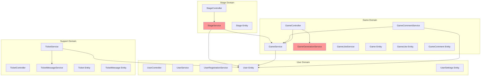

# DDD Анализ и рекомендации по рефакторингу

## Содержание
1. [Оценка текущей архитектуры](#1-оценка-текущей-архитектуры)
2. [Выявленные проблемы DDD](#2-выявленные-проблемы-ddd)
3. [Дублирование кода с примерами](#3-дублирование-кода-с-примерами)
4. [Рекомендации с примерами кода](#4-рекомендации-с-примерами-кода)
5. [План внедрения](#5-план-внедрения)

---

## 1. Оценка текущей архитектуры

### 1.1 Что сделано хорошо ✅

```
src/
├── Game/           # Домен: Игры
├── Stage/          # Домен: Этапы игр  
├── User/           # Домен: Пользователи
├── Support/        # Домен: Техподдержка
└── DTO/            # Общие DTO
```

**Плюсы:**
- Модульная структура по доменам - уже близко к DDD
- Каждый модуль содержит Controller, Service, Entity, Repository, DTO
- Разделение Request/Response DTO
- Централизованная обработка ошибок через [`ApiException`](src/Exception/ApiException.php)

### 1.2 Текущая диаграмма зависимостей



**🔴 Проблемные зависимости отмечены красным** - кросс-доменные обращения

---

## 2. Выявленные проблемы DDD

### 2.1 Нарушение границ доменов (Bounded Contexts)

**Проблема:** [`StageService`](src/Stage/Service/StageService.php) напрямую зависит от [`GameService`](src/Game/Service/GameService.php)

```php
// StageService.php:19
public function __construct(
    private readonly EntityManagerInterface $entityManager,
    private readonly GameService $gameService,  // ❌ Кросс-доменная зависимость
) {}
```

**Решение:** Stage должен использовать только GameRepository или Domain Event

### 2.2 Бизнес-логика в Entity

**Проблема:** [`User`](src/User/Entity/User.php) содержит методы проверки прав:

```php
// User.php:237-245
public function isAdmin(): bool
{
    return in_array('ROLE_ADMIN', $this->getRoles());
}

public function isGameAuthor(Game $game): bool
{
    return $this->getId() === $game->getAuthor()->getId();
}
```

**Почему это плохо:**
- Entity не должна знать о бизнес-правилах
- Нарушает Single Responsibility Principle
- Затрудняет тестирование

**Решение:** Использовать Symfony Voters

### 2.3 Анемичные сущности

**Проблема:** Сущности не содержат инвариантов:

```php
// Game.php - нет валидации бизнес-правил
public function setMinAge(?int $minAge): static
{
    $this->minAge = $minAge;  // ❌ Нет проверки что minAge > 0
    return $this;
}
```

**Решение:** Добавить валидацию в entity:

```php
public function setMinAge(?int $minAge): static
{
    if ($minAge !== null && $minAge < 0) {
        throw new \InvalidArgumentException('Min age cannot be negative');
    }
    $this->minAge = $minAge;
    return $this;
}
```

### 2.4 Отсутствие Aggregate Root паттерна

**Проблема:** Нет чёткого разделения между агрегатами и сущностями

**Текущее состояние:**
- `Game` содержит `Stage[]`, `GameComment[]`, `GameLike[]`
- Но доступ к Stage идёт напрямую через StageRepository

**Правильно по DDD:**
- `Game` - Aggregate Root
- `Stage` - Entity внутри агрегата Game
- Доступ к Stage только через Game

### 2.5 Создание зависимостей в конструкторе Entity

**Проблема:** [`User::__construct()`](src/User/Entity/User.php:78-87)

```php
public function __construct()
{
    $this->likes = new ArrayCollection();
    $this->userSettings = new UserSettings();  // ❌ Создание объекта
    $this->userSettings->setOwner($this);
    $this->tickets = new ArrayCollection();
    $this->assignedTickets = new ArrayCollection();
}
```

**Решение:** Использовать Factory pattern:

```php
class UserFactory
{
    public function create(string $email, string $password): User
    {
        $user = new User($email, $password);
        $user->setUserSettings(new UserSettings($user));
        return $user;
    }
}
```

---

## 3. Дублирование кода с примерами

### 3.1 🔴 Дублирование findOrFail паттерна

**Файлов:** 5+ сервисов

```php
// GameService.php:170-177
private function findGameOrFail(int $id): Game
{
    $game = $this->gameRepository->find($id);
    if (!$game) {
        throw new ApiException(ErrorCode::GAME_NOT_FOUND);
    }
    return $game;
}

// GameCommentService.php:98-107
private function findCommentOrFail(int $commentId): GameComment
{
    $comment = $this->commentRepository->find($commentId);
    if (!$comment) {
        throw new ApiException(ErrorCode::COMMENT_NOT_FOUND);
    }
    return $comment;
}

// TicketService.php:107-116
private function findOrFail(int $id): Ticket
{
    $ticket = $this->repo->find($id);
    if (!$ticket) {
        throw new ApiException(ErrorCode::NOT_FOUND);
    }
    return $ticket;
}

// UserService.php:72-81
public function getUser(int $id): User
{
    $user = $this->userRepository->find($id);
    if (!$user) {
        throw new ApiException(ErrorCode::USER_NOT_FOUND);
    }
    return $user;
}
```

### 3.2 🔴 Дублирование checkAccess/checkOwnership

**Файлов:** 4+ сервиса

```php
// GameService.php:179-184
private function checkAccess(Game $game, User $user): void
{
    if (!$user->isAdmin() && !$user->isGameAuthor($game)) {
        throw new ApiException(ErrorCode::FORBIDDEN);
    }
}

// GameCommentService.php:109-114
private function checkCommentOwnership(GameComment $comment, User $user): void
{
    if ($comment->getAuthor()->getId() !== $user->getId()) {
        throw new ApiException(ErrorCode::FORBIDDEN);
    }
}

// StageService.php:82-87
private function checkAccess(Game $game, User $user): void
{
    if ($game->getAuthor()->getId() !== $user->getId() && !in_array('ROLE_ADMIN', $user->getRoles())) {
        throw new ApiException(ErrorCode::FORBIDDEN);
    }
}

// TicketService.php:118-123
private function denySupport(User $user): void
{
    if (!in_array('ROLE_SUPPORT', $user->getRoles())) {
        throw new ApiException(ErrorCode::FORBIDDEN);
    }
}
```

### 3.3 🔴 Дублирование пагинации

**Файлов:** 6+ методов

```php
// GameController.php:39-40
$page = $request->query->getInt('page', 1);
$limit = $request->query->getInt('limit', 20);

// GameService.php:47-62
$items = $this->gameRepository->findBy(
    ['isPublic' => true],
    ['createdAt' => 'DESC'],
    $limit,
    ($page - 1) * $limit
);
$total = $this->gameRepository->count(['isPublic' => true]);
return [
    'items' => $this->attachLikeInfo($items, $user),
    'total' => $total
];

// UserService.php:83-98 - АНАЛОГИЧНО
$items = $this->userRepository->findBy(
    ['isBlocked' => false],
    ['id' => 'DESC'],
    $limit,
    ($page - 1) * $limit
);
$total = $this->userRepository->count(['isBlocked' => false]);
return [
    'items' => $items,
    'total' => $total
];

// GameCommentService.php:25-42 - АНАЛОГИЧНО
// TicketMessageService.php - АНАЛОГИЧНО
```

### 3.4 🔴 Дублирование partial update паттерна

**Файлов:** 4+ метода

```php
// GameService.php:122-151
if ($request->title !== null) {
    $game->setTitle($request->title);
}
if ($request->description !== null) {
    $game->setDescription($request->description);
}
if ($request->minAge !== null) {
    $game->setMinAge($request->minAge);
}
// ... ещё 8 полей

// StageService.php:49-64
if ($request->title !== null) {
    $stage->setTitle($request->title);
}
if ($request->description !== null) {
    $stage->setDescription($request->description);
}
// ... ещё 3 поля

// UserService.php:26-63
if ($request->name !== null) {
    $user->setName($request->name);
}
if ($request->lastName !== null) {
    $user->setLastName($request->lastName);
}
// ... ещё 4 поля
```

### 3.5 🔴 Дублирование timestamp полей

**Файлов:** 5+ entities

```php
// Game.php
#[ORM\Column]
private ?\DateTimeImmutable $createdAt;

#[ORM\Column(nullable: true)]
private ?\DateTimeImmutable $updatedAt = null;

#[ORM\PreUpdate]
public function setUpdatedAt(): void
{
    $this->updatedAt = new \DateTimeImmutable();
}

// Ticket.php - АНАЛОГИЧНО
// Stage.php - АНАЛОГИЧНО  
// GameComment.php - АНАЛОГИЧНО (но без PreUpdate)
// TicketMessage.php - АНАЛОГИЧНО
```

### 3.6 🔴 Дублирование author поля

**Файлов:** 4+ entities

```php
// Game.php
#[ORM\ManyToOne]
#[ORM\JoinColumn(nullable: false)]
private ?User $author = null;

// GameComment.php - АНАЛОГИЧНО
// Ticket.php - АНАЛОГИЧНО
// TicketMessage.php - АНАЛОГИЧНО
```

### 3.7 🔴 Дублирование структуры ответа с пагинацией

**Файлов:** 5+ контроллеров

```php
// GameController.php:44-54
return ApiResponse::success([
    'items' => array_map(
        fn($item) => GameResponse::fromEntity($item['game'], $item['isLiked']),
        $result['items']
    ),
    'pagination' => [
        'page' => $page,
        'limit' => $limit,
        'total' => $result['total']
    ]
]);

// GameController.php:68-78 - АНАЛОГИЧНО (listLike)
// GameController.php:91-101 - АНАЛОГИЧНО (listMy)
```

---

## 4. Рекомендации с примерами кода

### 4.1 Создать TimestampableTrait

**Файл:** `src/Shared/Trait/TimestampableTrait.php`

```php
<?php

namespace App\Shared\Trait;

use Doctrine\ORM\Mapping as ORM;

trait TimestampableTrait
{
    #[ORM\Column]
    private ?\DateTimeImmutable $createdAt = null;

    #[ORM\Column(nullable: true)]
    private ?\DateTimeImmutable $updatedAt = null;

    #[ORM\PrePersist]
    public function setCreatedAtValue(): void
    {
        $this->createdAt = new \DateTimeImmutable();
    }

    #[ORM\PreUpdate]
    public function setUpdatedAtValue(): void
    {
        $this->updatedAt = new \DateTimeImmutable();
    }

    public function getCreatedAt(): ?\DateTimeImmutable
    {
        return $this->createdAt;
    }

    public function getUpdatedAt(): ?\DateTimeImmutable
    {
        return $this->updatedAt;
    }
}
```

**Использование:**

```php
// Game.php
use App\Shared\Trait\TimestampableTrait;

#[ORM\Entity(repositoryClass: GameRepository::class)]
#[ORM\HasLifecycleCallbacks]
class Game
{
    use TimestampableTrait;
    
    // createdAt, updatedAt и методы теперь здесь
}
```

### 4.2 Создать AuthorableTrait

**Файл:** `src/Shared/Trait/AuthorableTrait.php`

```php
<?php

namespace App\Shared\Trait;

use App\User\Entity\User;
use Doctrine\ORM\Mapping as ORM;

trait AuthorableTrait
{
    #[ORM\ManyToOne]
    #[ORM\JoinColumn(nullable: false)]
    private ?User $author = null;

    public function getAuthor(): ?User
    {
        return $this->author;
    }

    public function setAuthor(?User $author): static
    {
        $this->author = $author;
        return $this;
    }

    public function isAuthor(User $user): bool
    {
        return $this->author?->getId() === $user->getId();
    }
}
```

### 4.3 Создать PaginationHelper

**Файл:** `src/Shared/Helper/PaginationHelper.php`

```php
<?php

namespace App\Shared\Helper;

use Symfony\Component\HttpFoundation\Request;

class PaginationHelper
{
    public static function extractFromRequest(Request $request, int $defaultLimit = 20): PaginationParams
    {
        return new PaginationParams(
            page: $request->query->getInt('page', 1),
            limit: $request->query->getInt('limit', $defaultLimit)
        );
    }
}
```

**Файл:** `src/Shared/DTO/PaginationParams.php`

```php
<?php

namespace App\Shared\DTO;

readonly class PaginationParams
{
    public function __construct(
        public int $page = 1,
        public int $limit = 20
    ) {}

    public function getOffset(): int
    {
        return ($this->page - 1) * $this->limit;
    }
}
```

**Файл:** `src/Shared/DTO/PaginatedResult.php`

```php
<?php

namespace App\Shared\DTO;

readonly class PaginatedResult
{
    /**
     * @param array $items
     * @param int $total
     * @param PaginationParams $params
     */
    public function __construct(
        public array $items,
        public int $total,
        public PaginationParams $params
    ) {}

    public function toArray(): array
    {
        return [
            'items' => $this->items,
            'pagination' => [
                'page' => $this->params->page,
                'limit' => $this->params->limit,
                'total' => $this->total
            ]
        ];
    }
}
```

**Использование в контроллере:**

```php
// GameController.php - ДО
$page = $request->query->getInt('page', 1);
$limit = $request->query->getInt('limit', 20);
$result = $this->gameService->getPublicGames($page, $limit);

return ApiResponse::success([
    'items' => array_map(...),
    'pagination' => [
        'page' => $page,
        'limit' => $limit,
        'total' => $result['total']
    ]
]);

// GameController.php - ПОСЛЕ
$pagination = PaginationHelper::extractFromRequest($request);
$result = $this->gameService->getPublicGames($pagination);

return ApiResponse::success($result->toArray(
    fn($item) => GameResponse::fromEntity($item['game'], $item['isLiked'])
));
```

### 4.4 Создать базовый AbstractEntityService

**Файл:** `src/Shared/Service/AbstractEntityService.php`

```php
<?php

namespace App\Shared\Service;

use App\Shared\Enum\ErrorCode;use App\Shared\Exception\ApiException;use Doctrine\ORM\EntityManagerInterface;use Doctrine\ORM\EntityRepository;

abstract class AbstractEntityService
{
    public function __construct(
        protected EntityManagerInterface $entityManager
    ) {}

    /**
     * @throws ApiException
     */
    protected function findOrFail(int $id, ?ErrorCode $errorCode = null): object
    {
        $entity = $this->getRepository()->find($id);
        
        if (!$entity) {
            throw new ApiException($errorCode ?? $this->getNotFoundErrorCode());
        }
        
        return $entity;
    }

    protected function getRepository(): EntityRepository
    {
        return $this->entityManager->getRepository($this->getEntityClass());
    }

    abstract protected function getEntityClass(): string;
    
    protected function getNotFoundErrorCode(): ErrorCode
    {
        return ErrorCode::NOT_FOUND;
    }
}
```

**Использование:**

```php
// GameService.php - ДО
class GameService
{
    private function findGameOrFail(int $id): Game
    {
        $game = $this->gameRepository->find($id);
        if (!$game) {
            throw new ApiException(ErrorCode::GAME_NOT_FOUND);
        }
        return $game;
    }
}

// GameService.php - ПОСЛЕ
class GameService extends AbstractEntityService
{
    protected function getEntityClass(): string
    {
        return Game::class;
    }
    
    protected function getNotFoundErrorCode(): ErrorCode
    {
        return ErrorCode::GAME_NOT_FOUND;
    }
    
    // Теперь можно использовать $this->findOrFail($id)
}
```

### 4.5 Создать Symfony Voters для авторизации

**Файл:** `src/Shared/Security/AbstractOwnerVoter.php`

```php
<?php

namespace App\Shared\Security;

use App\User\Entity\User;
use Symfony\Component\Security\Core\Authentication\Token\TokenInterface;
use Symfony\Component\Security\Core\Authorization\Voter\Voter;

abstract class AbstractOwnerVoter extends Voter
{
    protected function voteOnAttribute(string $attribute, mixed $subject, TokenInterface $token): bool
    {
        $user = $token->getUser();
        
        if (!$user instanceof User) {
            return false;
        }

        // Админы имеют полный доступ
        if ($this->isAdmin($user)) {
            return true;
        }

        return match ($attribute) {
            'VIEW' => $this->canView($subject, $user),
            'EDIT' => $this->canEdit($subject, $user),
            'DELETE' => $this->canDelete($subject, $user),
            default => false,
        };
    }

    protected function isAdmin(User $user): bool
    {
        return in_array('ROLE_ADMIN', $user->getRoles());
    }

    protected function isOwner(mixed $subject, User $user): bool
    {
        if (method_exists($subject, 'getAuthor')) {
            return $subject->getAuthor()?->getId() === $user->getId();
        }
        return false;
    }

    protected function canView(mixed $subject, User $user): bool
    {
        return true; // Переопределить в потомках
    }

    protected function canEdit(mixed $subject, User $user): bool
    {
        return $this->isOwner($subject, $user);
    }

    protected function canDelete(mixed $subject, User $user): bool
    {
        return $this->isOwner($subject, $user);
    }
}
```

**Файл:** `src/Game/Security/GameVoter.php`

```php
<?php

namespace App\Game\Security;

use App\Game\Entity\Game;
use App\Shared\Security\AbstractOwnerVoter;

class GameVoter extends AbstractOwnerVoter
{
    protected function supports(string $attribute, mixed $subject): bool
    {
        return $subject instanceof Game && in_array($attribute, ['VIEW', 'EDIT', 'DELETE']);
    }

    protected function canView(Game $game, User $user): bool
    {
        if ($game->isPublic()) {
            return true;
        }
        
        return $this->isOwner($game, $user) || $this->isAdmin($user);
    }
}
```

**Использование в контроллере:**

```php
// GameController.php - ДО
#[Route('/{id}', name: 'update', methods: ['PUT', 'PATCH'])]
public function update(int $id, UpdateGameRequest $request, User $user): JsonResponse
{
    $game = $this->gameService->updateGame($id, $request, $user);
    return ApiResponse::success(GameResponse::fromEntity($game));
}

// GameController.php - ПОСЛЕ
#[Route('/{id}', name: 'update', methods: ['PUT', 'PATCH'])]
#[IsGranted('EDIT', 'game')]
public function update(Game $game, UpdateGameRequest $request): JsonResponse
{
    $game = $this->gameService->updateGame($game, $request);
    return ApiResponse::success(GameResponse::fromEntity($game));
}
```

### 4.6 Исправить N+1 проблему в GameResponse

**Файл:** `src/Game/Repository/GameRepository.php`

```php
// ДОБАВИТЬ метод для получения с counts
public function findPublicWithCounts(int $limit, int $offset): array
{
    $qb = $this->createQueryBuilder('g')
        ->select('g', 'COUNT(DISTINCT c.id) as commentsCount', 'COUNT(DISTINCT l.id) as likesCount')
        ->leftJoin('g.comments', 'c')
        ->leftJoin('g.likes', 'l')
        ->where('g.isPublic = true')
        ->groupBy('g.id')
        ->orderBy('g.createdAt', 'DESC')
        ->setFirstResult($offset)
        ->setMaxResults($limit);
    
    return $qb->getQuery()->getResult();
}
```

**Или использовать DTO Projection:**

```php
// src/Game/DTO/GameListDTO.php
readonly class GameListDTO
{
    public function __construct(
        public int $id,
        public ?string $title,
        public ?string $description,
        public int $commentsCount,
        public int $likesCount,
        public string $createdAt
    ) {}
}

// GameRepository.php
public function findPublicList(int $limit, int $offset): array
{
    return $this->createQueryBuilder('g')
        ->select('NEW App\Game\DTO\GameListDTO(
            g.id, g.title, g.description,
            COUNT(DISTINCT c.id), COUNT(DISTINCT l.id),
            g.createdAt
        )')
        ->leftJoin('g.comments', 'c')
        ->leftJoin('g.likes', 'l')
        ->where('g.isPublic = true')
        ->groupBy('g.id')
        ->orderBy('g.createdAt', 'DESC')
        ->setFirstResult($offset)
        ->setMaxResults($limit)
        ->getQuery()
        ->getResult();
}
```

### 4.7 Убрать кросс-доменные зависимости

**Проблема:** StageService → GameService

**Решение:** Использовать Domain Events или прямой Repository

```php
// StageService.php - ДО
public function __construct(
    private readonly GameService $gameService,  // ❌
) {}

// StageService.php - ПОСЛЕ (Вариант 1: Repository)
public function __construct(
    private readonly GameRepository $gameRepository,  // ✅
) {}

// StageService.php - ПОСЛЕ (Вариант 2: Domain Event)
// В StageController:
#[Route('', methods: ['POST'])]
public function create(CreateStageRequest $request, User $user): JsonResponse
{
    $game = $this->gameRepository->find($request->gameId);
    
    if (!$game) {
        throw new ApiException(ErrorCode::GAME_NOT_FOUND);
    }
    
    $this->denyAccessUnlessGranted('EDIT', $game);
    
    $stage = $this->stageService->create($game, $request);
    
    return ApiResponse::success(StageResponse::fromEntity($stage));
}
```

### 4.8 Создать UserFactory

**Файл:** `src/User/Factory/UserFactory.php`

```php
<?php

namespace App\User\Factory;

use App\User\Entity\User;
use App\User\Entity\UserSettings;
use Symfony\Component\PasswordHasher\Hasher\UserPasswordHasherInterface;

class UserFactory
{
    public function __construct(
        private UserPasswordHasherInterface $passwordHasher
    ) {}

    public function create(string $email, string $password, array $roles = ['ROLE_USER']): User
    {
        $user = new User();
        $user->setEmail($email);
        $user->setPassword($this->passwordHasher->hashPassword($user, $password));
        $user->setRoles($roles);
        
        // Создаём настройки через factory method
        $user->setUserSettings(UserSettings::createForUser($user));
        
        return $user;
    }
}
```

---

## 5. План внедрения

### Фаза 1: Traits и Helpers (без изменения API)

| Задача | Приоритет | Сложность |
|--------|-----------|-----------|
| Создать `TimestampableTrait` | Высокий | Низкая |
| Создать `AuthorableTrait` | Высокий | Низкая |
| Создать `PaginationParams` и `PaginationHelper` | Высокий | Низкая |
| Создать `PaginatedResult` | Средний | Низкая |

### Фаза 2: Базовые классы

| Задача | Приоритет | Сложность |
|--------|-----------|-----------|
| Создать `AbstractEntityService` | Средний | Средняя |
| Создать `AbstractOwnerVoter` | Высокий | Средняя |
| Создать `GameVoter`, `CommentVoter`, `TicketVoter` | Высокий | Средняя |
| Создать `UserFactory` | Средний | Низкая |

### Фаза 3: Рефакторинг сервисов

| Задача | Приоритет | Сложность |
|--------|-----------|-----------|
| Наследовать сервисы от `AbstractEntityService` | Средний | Средняя |
| Удалить дублирующие `findOrFail` методы | Средний | Низкая |
| Заменить `checkAccess` на Voters | Высокий | Высокая |
| Убрать кросс-доменные зависимости | Высокий | Высокая |

### Фаза 4: Оптимизация

| Задача | Приоритет | Сложность |
|--------|-----------|-----------|
| Исправить N+1 в `GameResponse` | Высокий | Средняя |
| Вынести AI API конфигурацию | Низкий | Низкая |
| Удалить TODO комментарии | Низкий | Низкая |

---

## Приложение: Сводка дублирования

| Тип дублирования | Файлов | Строк кода |
|------------------|--------|------------|
| findOrFail паттерн | 5+ | ~50 |
| checkAccess/Ownership | 4+ | ~25 |
| Пагинация | 6+ | ~60 |
| Partial update | 4+ | ~80 |
| Timestamp поля | 5+ | ~75 |
| Author поле | 4+ | ~40 |
| Pagination response | 5+ | ~50 |
| **Итого** | **34** | **~380** |

---

## Вопросы для обсуждения

1. **Приоритет фаз** - какую фазу начать первой?
2. **Обратная совместимость** - нужно ли сохранять текущий API?
3. **N+1 проблема** - использовать DTO projections или LEFT JOIN?
4. **Voters** - внедрять сразу или постепенно?
5. **UserFactory** - использовать в UserRegistrationService сразу?
